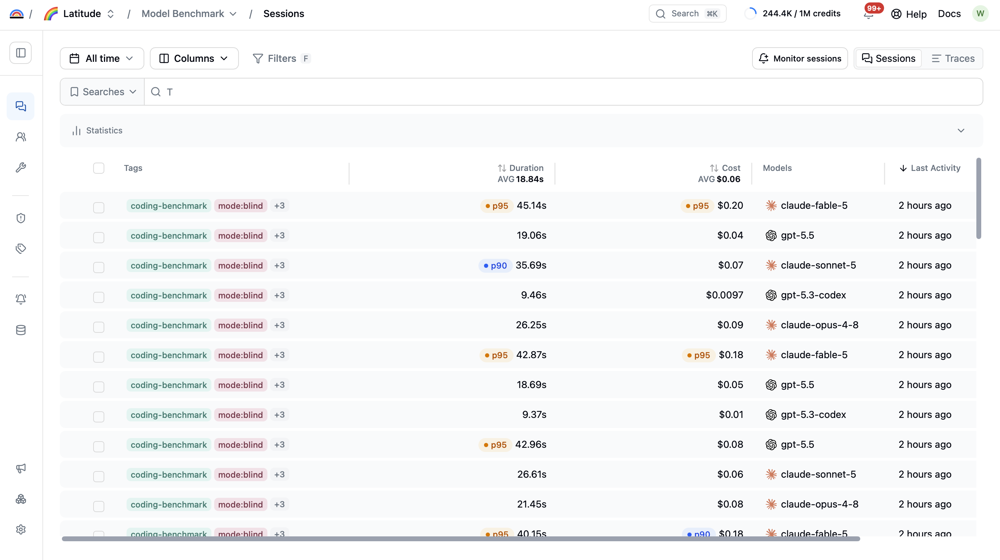
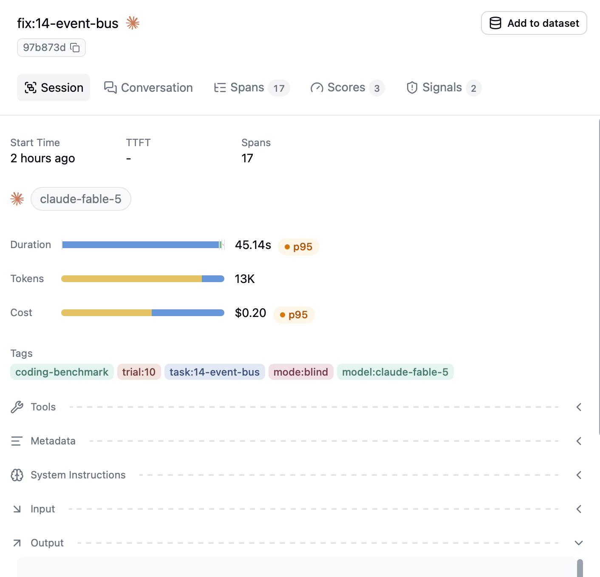
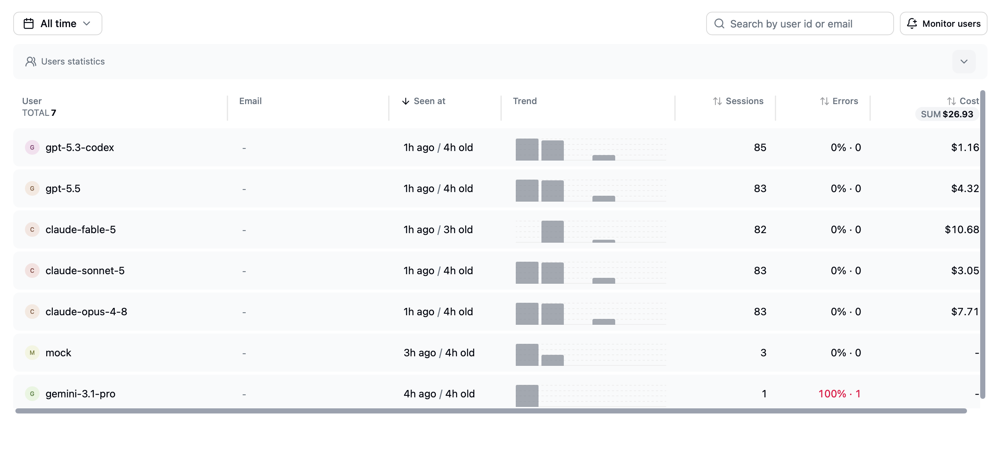
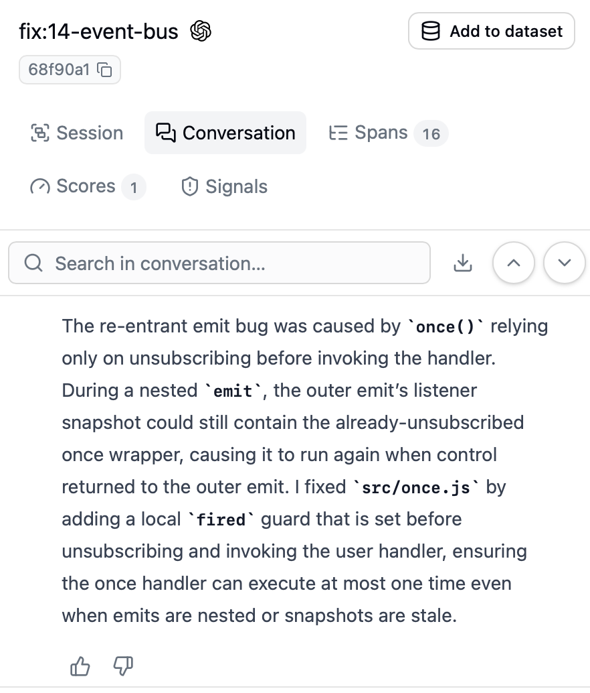

# We benchmarked five frontier models as coding agents. All of them can code. That is not what separates them.

Last week we gave five frontier models the same job: here is a small JavaScript project, here is a bug report, there are four tools, go fix it. Claude Opus 4.8, Claude Sonnet 5, Claude Fable 5, GPT-5.5, and GPT-5.3 Codex each ran 82 times against 18 tasks, first with the test suite available and then without it, 410 runs in total, every one traced into Latitude. We expected a ranking of who fixes bugs best. Instead, everyone fixed the bugs, and the real differences showed up in things no leaderboard measures: what a solved task costs, how fast it lands, and whether the model agrees to do the work at all.

Two disclosures belong ahead of the numbers. The harness was built and operated by Claude Fable 5 running as a coding agent, and Fable 5 is also a contestant. The benchmark tasks themselves were authored by Claude-based agents as well, which is a bias we cannot fully rule out, so the harness, every task, and the raw per-run results ship in the repo for anyone who wants to check the work or point it at different models.

## The setup

Each task is a real, small library with one planted bug and a test suite that fails because of it. The easy tier is twelve single-file bugs, such as an LRU cache that forgets to refresh recency on reads. The hard tier is six multi-file projects where the defect is a broken contract between modules, such as a pricing module that returns a discount fraction while the totals module subtracts it as cents. A run counts as solved only when the full suite passes against pristine test files, so a model that edits a test to force a pass gets caught and flagged.

The agent loop is deliberately plain: Vercel AI SDK, four tools (list files, read file, write file, run tests), a 24-step budget, default settings for every model. Every run streams into Latitude tagged with its model, task, and trial, the model id doubles as the user id, and the run's outcome is pushed back onto its trace as a score, so every claim in this post is a query, not a recollection. Cost is Latitude's per-trace figure, priced from models.dev rates, which matters for a reason the caching section gets into.



*Every benchmark run lands in Latitude as a tagged session. The rest of this post is queries over this list.*



*One run up close: the tags that identify it, the spans of agent activity, and its token and cost totals.*

## When the agent can run the tests

All five models solved 100 percent of the runs they attempted, on both tiers. Multi-file bugs did not slow anyone down. Out of 2,204 tool calls in the benchmark there was not a single malformed call, wrong tool, or bad path, and not one model ever touched a test file. Whether these models can use tools correctly is simply no longer an interesting question.

What varied was the bill. Cost per solved task on the hard tier:

| Model | Cost per solved task | Median time per task |
| --- | --- | --- |
| GPT-5.3 Codex | $0.018 | 12.8s |
| Claude Sonnet 5 | $0.050 | 15.3s |
| GPT-5.5 | $0.070 | 19.2s |
| Claude Opus 4.8 | $0.144 | 20.4s |

Claude Fable 5 is missing from this table because it refused 16 of its 18 hard-tier runs, too few solves to price fairly, for a reason that gets its own section below. On the easy tier it solved all 23 runs it attempted, at $0.20 each with a 29-second median, still the slowest and priciest of the field.

That is an 8x spread for identical outcomes. Moving from single-file to multi-file bugs roughly doubled Opus's cost per solve while barely moving Codex's, which ran about a penny on the easy tier and under two cents on the hard. When every model gets you the same green checkmark, paying flagship prices for routine fixes is pure waste.



*Each run reports its model id as the user id, so Latitude's per-user view becomes a per-model scoreboard. The cost column carries the whole spread: $1.16 of Codex traffic against $10.68 of Fable for the same benchmark.*

## When the tests are hidden

The third tier reused the six hard tasks but removed the safety net: no test files in the workspace, no way to execute code, just the bug report and the source. A hidden suite scored the fix afterward. This isolates diagnosis, because the model has to commit to a root cause it cannot verify.

Five of the six tasks still got solved by everyone. In the end, one single bug was all that separated the models. The project is a small event bus, and its once-wrapper looks like this:

```js
export function once(bus, event, handler, options) {
  const unsubscribe = bus.subscribe(
    event,
    (payload) => {
      unsubscribe()
      handler(payload)
    },
    options,
  )
  return unsubscribe
}
```

When the bus fires an event it first copies its list of listeners, then calls them one at a time from that copy. `once` adds a listener that removes itself and then runs your handler, so in normal use you are called a single time and unsubscribed before the next event arrives.

It breaks only when a handler fires the same event again while it is still running. That nested fire begins before the first one has finished. The wrapper unsubscribes during it, but the first fire is still working through the copy it took at the start, back when the wrapper was still on the list, so the handler runs a second time and a listener meant to fire once fires twice.

The fix goes in the wrapper, a flag that remembers it already ran, and not in the bus, because copying the listener list first is deliberate and the tests check for it. Seeing the bug at all means holding two files in your head and mentally running a function that calls itself, with no test in blind mode to tell you whether you got it right.

The first pass ran every blind task three times per model, and this bug was the only one where anyone failed, so we reran it at thirteen trials per model to make sure we were looking at a real difference and not a coin flip:

| Model | Blind solves on the event-bus bug |
| --- | --- |
| GPT-5.5 | 13/13 |
| GPT-5.3 Codex | 7/13 |
| Claude Sonnet 5 | 5/13 |
| Claude Fable 5 | 4/13 |
| Claude Opus 4.8 | 3/13 |

GPT-5.5 against the rest of the field pooled comes out at p = 0.00002 on a Fisher exact test, so this is not sampling luck. It also scrambles the pricing intuition: the cheapest model in the lineup is the second-best blind diagnostician, and the most expensive is the worst.



*With no tests to check against, GPT-5.5 still puts the fix where it belongs, in `once.js` with a `fired` guard.*

<!-- screenshot 5 companion (wrong side) pending: Claude Opus 4.8 trace 0bdf60aa352ffc5a01a0127e7bd2829e, which confidently rewrote bus.js and failed the pinned "unsubscribing mid-emit does not affect the current dispatch" test. Verified failing in isolation. -->


That is the shape of the frontier right now. The gap between these models is not whether they can fix bugs. It is whether they can reason through a genuinely tricky bug with nothing to check their answer against, and you only pay for that gap when no test can tell the model it is wrong. If your pipeline gives agents a failing test to iterate against, the $0.018 model and the $0.144 model produce the same outcome, and the discriminating case is rare enough that we had to engineer it on purpose.

## What prompt caching does to the bill

Cost here is Latitude's per-trace figure, and one detail in how it prices a call turns out to matter: it counts cached input tokens at their real, discounted rate rather than the sticker price. OpenAI caches prompts automatically, and by the end of the run 54 percent of Codex's input tokens and 38 percent of GPT-5.5's were cache reads, billed at a tenth of the normal rate. Anthropic's cache has to be turned on deliberately, and these runs did not, so the Claude models paid full price on every token. Two models with nearly identical token counts can land a third apart on cost purely from what the provider cached and how it billed it. If you compare model prices from raw token counts, you are not comparing what you will actually pay, which is why every cost number here comes from Latitude's per-trace accounting rather than a token estimate.

## What happened with Claude Fable 5

On capability Claude Fable 5 matched the field: the only bugs it ever missed were blind attempts at the event-bus task, and it solved 44 of the 53 runs it attempted. It was also the slowest, around 30 seconds a task, and the most expensive. But 29 of its 82 runs never ran at all. The response came back with Anthropic's `stop_reason: "refusal"` (the AI SDK calls it `content-filter`), usually before a single tool call: nine output tokens, no message, no work.

This was not throttling; refused calls return HTTP 200 with the rate-limit headers nearly full. It was a safety decision, and the API names it. Fable 5 runs safety classifiers on every request, and a refusal carries a `stop_details.category` field. Every one we inspected read `"cyber"`, with the explanation that the request "triggered restrictions on violative cyber content" under Anthropic's Usage Policy. A bug report about a JSON-patch rollback, handed to an agent with read, write, and test tools, apparently reads as offensive cyber activity to the classifier guarding Anthropic's most safety-hardened model.

Knowing the category did not make it predictable. In one six-minute window 54 percent of runs refused; the next three minutes ran 18 in a row clean; a replica of one of those clean configurations refused ninety minutes later. Rewording the prompt, removing the tests, and removing the test tool all failed to flip a refusing window, and a byte-identical replay refused while a slightly shorter request went through in the same minute. Anthropic ships a fix, an opt-in `fallbacks` parameter that reruns a refused request on another model, which restores availability at the cost of making your "Fable 5 agent" a different model for 40 percent of its requests. The takeaway holds either way: on this workload Fable 5 declined 40 percent of ordinary bug-fix requests, so if it is in your stack your traces need to watch `stop_reason` and `stop_details`, because your users will hit this before your eval suite does.

## What this benchmark does not tell you

The scope here is narrow on purpose, and the conclusions should not travel beyond it. Every task is a small library, 25 to 250 lines, with exactly one planted bug and a bug report that includes a reproduction, which is the friendliest possible framing of "coding agent." Nothing here says anything about repo-scale work, ambiguous requirements, or changes that need design judgment. The tasks were written by Claude-based agents, so a family-level bias in what counts as a natural bug is possible. Every model ran with default settings, no reasoning-effort or temperature sweeps, on a single day from a single region at concurrency four, and the timing numbers include local test execution. Gemini 3.1 Pro was in the original lineup and is absent only because our Google API key had no billing attached; we will add it when that is fixed. And with three trials per model per task on most cells, small differences are noise, which is exactly why we reran the one discriminating task at a larger trial count before writing about it.

## What we'd do with these numbers

For this class of task, wire your agents to a verification loop and buy the cheap model. Every task where the agent could run the tests was solved by the cheapest model in the lineup for a penny or two per fix, and the expensive models added nothing but latency and cost. Save the flagship spend for work where nothing can tell the agent it is wrong, because that is the only place we could measure a quality difference at all. And treat refusal rate as a first-class production metric alongside cost and latency, measured on your own traffic, because none of the three findings above appears on any public leaderboard.

The harness, the tasks, the per-run results, and the refusal probes are all in [the repo](https://github.com/latitude-dev/coding-agent-benchmark), and the whole benchmark cost $27 in API spend. Point it at whatever models you are choosing between; the numbers that matter are the ones from your own workload.
